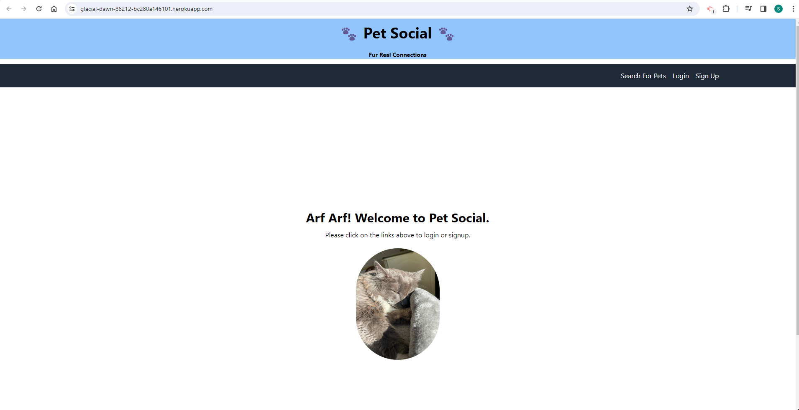

# Pet-Social

## Screenshot

## Description

A unique social media app exclusively for pets and their humans. Say goodbye to unwanted content and hello to a community that's all about adorable pets and the joy they bring. No more scrolling through unrelated posts – just pure, unfiltered pet happiness! Join us and create a profile exclusively for your furry friend, where their cuteness takes center stage. Finally, a social media haven for pet lovers.

## Table of Contents

- [Technology](#technology)
- [Contributors](#contributors)
- [Installation](#installation)
- [Links](#links)
- [License](#license)

## Technologies Used 

MongoDB - A NoSQL database system that is used to store, manage, and retrieve data in a flexible, schema-free format, particularly well-suited for applications with evolving and unpredictable data structures.
ExpressJS - A web application framework for Node.js that simplifies the process of building scalable and robust web applications by providing a set of features and tools for handling HTTP requests and responses.
ReactJS - Used to build elements of page including header, nav-bar, core content which changes based on user interaction, and footer.
NodeJS - A JavaScript runtime that allows developers to execute server-side code, enabling the development of scalable and efficient network applications.
Tailiwindcss - A utility-first CSS framework that provides a low-level set of building blocks for designing and styling web interfaces with a focus on flexibility and efficiency.
JWT - JSON Web Token, is a compact, URL-safe means of representing claims between two parties. It is often used for authentication and authorization purposes in web development.
GraphQL - A query language and runtime for APIs (Application Programming Interfaces) that was developed by Facebook. It provides a more efficient, powerful, and flexible alternative to traditional REST APIs.

## Contributors 

Donna Goon: https://github.com/GDonna

## Installation 

To install the Pet Social app, git clone the repository to your local computer. The user must also install Node.js and Tailwindcss in order to use this application.

## Links 

Deployed Link: https://guarded-basin-73624-223ecb536746.herokuapp.com/

GitHub Repo: https://github.com/SherryK1103/Pet-Social

## Licenses 

This project is covered under the MIT License https://opensource.org/licenses/MIT
